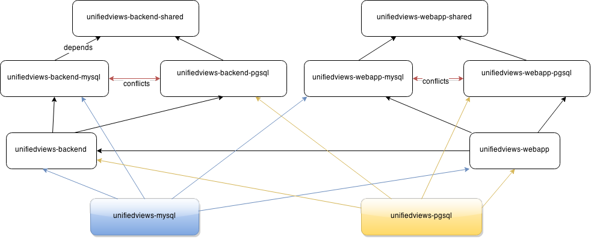

Packages
========

**Debian packages are not supported in UnifiedViews 3.X**

How to install UnifiedViews from debian packages? See [Installation Guide](https://grips.semantic-web.at/display/UDDOC/Installation+Guide)

How to create .deb packages for Debian:

go to where pom.xml is placed and run
~~~bash
mvn package
~~~

that creates files .deb in target/

The known issues:
- be aware of the possible problem - https://github.com/UnifiedViews/Core/issues/258
- to add backup configuration before an update installation of packages
- to clean database schema during a purge phase 
- to change location from /etc/unifiedviews to /etc/default/unifiedview
